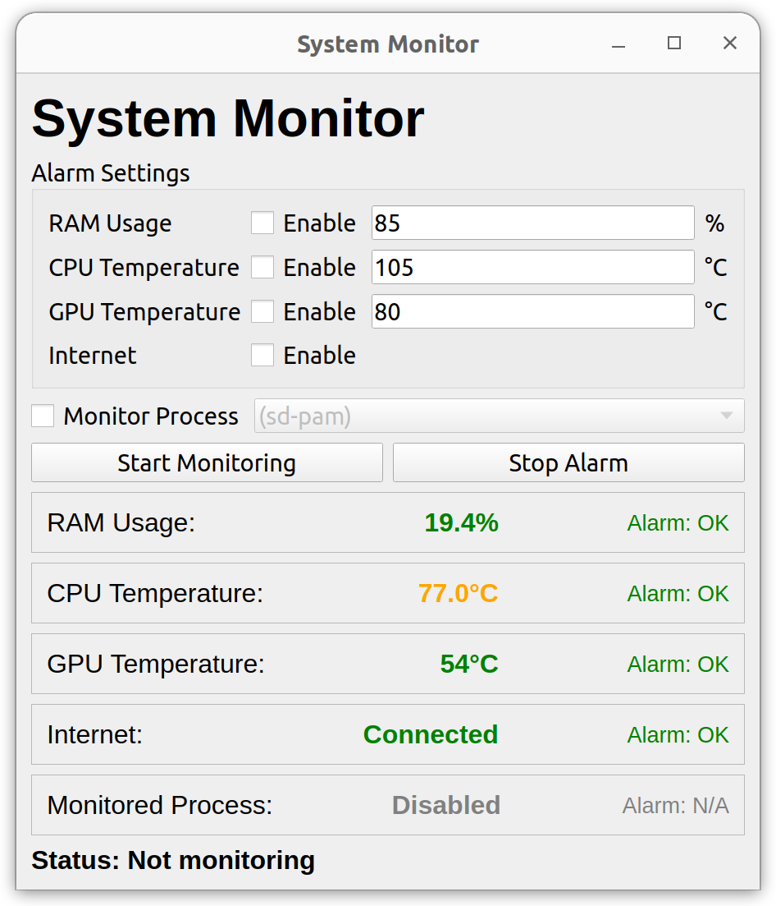

# System Monitor



This is a simple system monitor that displays the CPU, memory usage, internet status, and other indicators of the system. It is written in Python by LLM (Claude-3.5-Sonnet) and some prompts.

**Note:** I was really surprised to see this perfect code written by a LLM. =))))


## Installation

```python
pip install -r requirements.txt
```

## Usage

```python
python3 main.py
```
